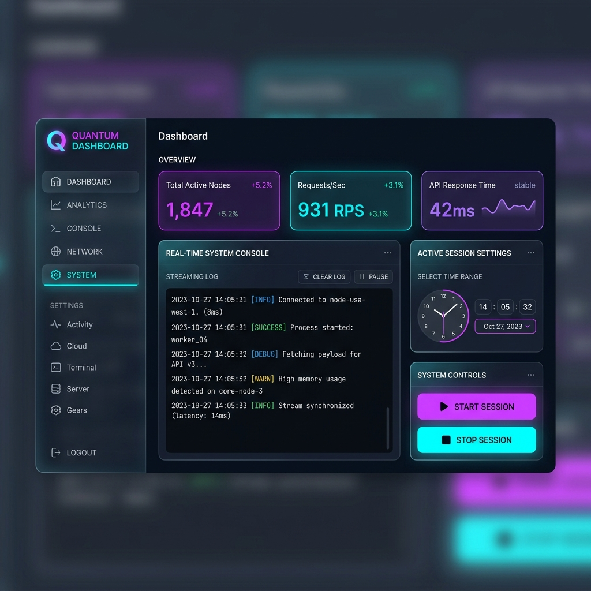

# Secondo cervello: base di conoscenza locale

[](https://www.python.org/)
[](LICENSE)

Il secondo cervello è una base di conoscenza locale basata su Obsidian e gestita tramite agenti di intelligenza artificiale. Il sistema automatizza l'importazione di note, compiti ed eventi da Notion, caselle di posta e-mail, calendari e pagine web, organizzandoli in una struttura semantica coerente che ne facilita lo studio e la ricerca rapida.

---

## Indice
1. [Demo / anteprima](#demo--anteprima)
2. [Prerequisiti e installazione](#prerequisiti-e-installazione)
3. [Guida all'uso](#guida-alluso)
4. [Funzionalità](#funzionalità)
5. [Documentazione aggiuntiva](#documentazione-aggiuntiva)
6. [Contribuire](#contribuire)
7. [Licenza](#licenza)
8. [Contatti e riconoscimenti](#contatti-e-riconoscimenti)

---

## Demo / anteprima

Il sistema dispone di un'interfaccia web scura in stile glassmorphism per monitorare i processi di sincronizzazione in tempo reale e configurare lo scheduler universale:



---

## Prerequisiti e installazione

### Prerequisiti
* Sistema operativo macOS, Linux o Windows (la temporizzazione automatica è gestita universalmente in Python).
* Python 3.10 o versione successiva.
* Git installato e configurato.

### Installazione
1. Clona questo repository all'interno della cartella dei tuoi progetti.
2. Crea l'ambiente virtuale (`.venv`), installa le dipendenze richieste e genera il template del file di configurazione esibendo il comando:
   ```bash
   make setup
   ```
3. Apri il file `.env` e configura le chiavi di autenticazione per i servizi esterni:
   * `GEMINI_API_KEY`: per l'accesso ai modelli di elaborazione Gemini.
   * `NOTION_TOKEN`: per importare i compiti e l'agenda da Notion.
   * `TELEGRAM_BOT_TOKEN`: per abilitare l'interazione via chat con il bot di controllo.
   * Parametri SMTP per la spedizione dei briefing via e-mail.

---

## Guida all'uso

### Avvio della dashboard e dello scheduler
Per lanciare l'applicazione web locale (dashboard, scheduler di background e server MCP):
```bash
make dashboard
```
L'interfaccia risponderà all'indirizzo `http://localhost:8000`.

*Nota per macOS: se si desidera che la dashboard rimanga attiva in background anche dopo la chiusura del terminale, installa il servizio di sistema tramite:*
```bash
make install-service
```
Per rimuoverlo:
```bash
make uninstall-service
```

### Connessione di Antigravity Desktop (Installazione su server)
Se il secondo cervello è installato su un server remoto (la destinazione ideale per un funzionamento costante), puoi connettere l'applicazione desktop di Antigravity installata sul tuo computer locale per interagire con il vault remoto.

1. **Prerequisito**: assicurati che la porta `8000` del server sia raggiungibile, oppure configura un reverse proxy (come Nginx) con SSL per esporre il servizio in modo sicuro su HTTPS.
2. **Configurazione dell'applicazione**: apri le impostazioni dei server MCP all'interno di Antigravity Desktop (o nel file di configurazione `mcp_config.json` del tuo client) e inserisci una nuova connessione di tipo **SSE**:
   * **URL dell'endpoint**: `http://<ip-del-tuo-server>:8000/mcp/sse` (oppure `https://<tuo-dominio>/mcp/sse` se configurato con certificato SSL).
3. **Esempio di configurazione JSON (`mcp_config.json`)**:
   ```json
   {
     "mcpServers": {
       "secondo-cervello": {
         "url": "https://<tuo-dominio-o-ip>/mcp/sse"
       }
     }
   }
   ```
4. **Sicurezza (consigliata)**: si consiglia di non esporre la porta in modo aperto su internet non protetto. Utilizza una VPN privata (come WireGuard o Tailscale) per accedere all'IP del server in sicurezza, o proteggi l'endpoint dietro autenticazione.

### Interazione tramite riga di comando
* **Interrogare il secondo cervello**:
  ```bash
  python engine/main.py query "Quali sono le prossime scadenze del progetto Galattica?"
  ```
* **Distillare e riassumere un saggio o libro**:
  ```bash
  python engine/main.py distill percorso/del/documento.pdf it
  ```
* **Registrare una nota di diario**:
  ```bash
  python engine/main.py journal "Incontrato il team di Scuola Open Source per definire il piano didattico."
  ```

---

## Funzionalità

* **Sincronizzazione da fonti eterogenee**: importa dati da account Notion (FF3300), calendari iCal/ICS, caselle di posta e-mail e pagine web.
* **Estrazione semantica**: analizza i testi grezzi importati per mappare concetti ed entità (persone, organizzazioni, progetti, eventi) compilando le relative note all'interno del wiki.
* **Scheduler asincrono universale**: esegue in background i compiti programmati (sincronizzazione, reflect, dream e briefing) leggendo la configurazione direttamente da `settings.md`.
* **Server MCP integrato**: espone un endpoint SSE all'indirizzo `/mcp` per connettere client esterni come l'applicazione desktop di Antigravity.
* **Controllo via bot Telegram**: supporta comandi rapidi per avviare sync specifici o interrompere i processi, oltre all'interrogazione semantica in linguaggio naturale.

---

## Documentazione aggiuntiva

Per approfondimenti sull'architettura dei moduli di importazione, sulla sincronizzazione bidirezionale dei task di Notion o sul funzionamento della modalità sogno notturna, consulta la guida tecnica di dettaglio in [DOCS.md](file:///Users/ff3300/Desktop/TOOLS/second_brain/DOCS.md).

---

## Contribuire

I contributi volti a migliorare il motore del secondo cervello sono benvenuti. Se desideri proporre modifiche:
1. Leggi le linee guida nel file [CONTRIBUTING.md](file:///Users/ff3300/Desktop/TOOLS/second_brain/CONTRIBUTING.md).
2. Segui le regole editoriali e grammaticali specificate in [buonsenso.md](file:///Users/ff3300/Desktop/TOOLS/second_brain/buonsenso.md).
3. Apri una segnalazione (issue) o invia direttamente una proposta di modifica (pull request).

---

## Licenza

Questo progetto è distribuito con licenza **GNU GPL v3**. I dettagli completi sono consultabili nel file [LICENSE](file:///Users/ff3300/Desktop/TOOLS/second_brain/LICENSE).

---

## Contatti e riconoscimenti

* Ideato e sviluppato da **noffolo** e dai collaboratori del Secondo Cervello.
* Per domande o segnalazioni di bug, puoi aprire una issue nell'apposita sezione su [GitHub Issues](https://github.com/noffolo/second-brain/issues).
